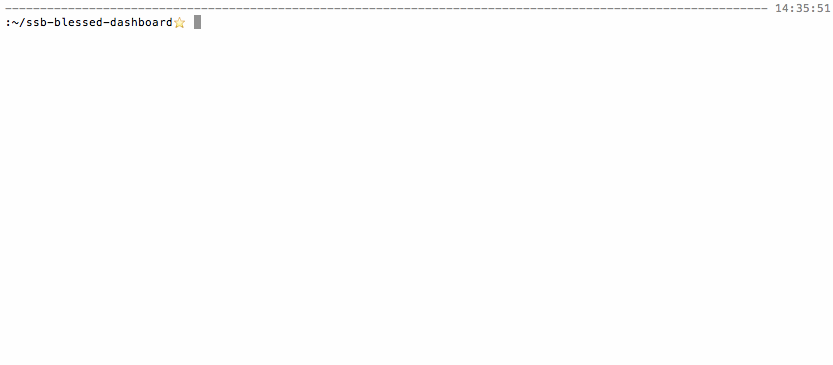

# SSB CLI Dashboard

```
git clone https://github.com/ssbc/ssb-cli-dashboard.git
cd ssb-cli-dashboard
npm install
```

Then:

```
# list all feeds
$ ./feeds.js

# view the given feed
$ ./feed.js {feedid}   

# view blobs linked-to by the given feed
$ ./blobs.js {feedid}

# view feeds related to the given feed
$ ./graph.js [follows|followers|flags|flaggers] {feedid}

# network status
$ ./gossip.js
```



## How it works

The `feeds.js` view pulls some metadata from Scuttlebot, and uses that to produce a master list of known feeds.

```js
// load data from sbot
var done = multicb({ pluck: 1, spread: true })

pull(
  sbot.latest(),                          // get the sequence number of the latest message of each known feed
  (filter) ? pull.filter(filter) : null,  // apply a filter, if given
  pull.collect(done())                    // collect into an array
)
sbot.friends.all('follow', done())        // fetch the computed follow-graph
sbot.friends.all('flag', done())          // fetch the computed flag-graph

done(function (err, feeds, follows, flags) {
  // ...
})
```

Each entry shows:

```
feedid [seq: N follows: N/N flags: N/N]
```

Where, in the case of follows and flags, it's showing the outbound then inbound.
It computes this info by counting directed-edges:

```js
// helper to count how many nodes in the graph have edges pointing to the given ID
// - graphs are given in the shape of { sourceIds: { destIds: true } }
// - eg. if bob follows alice, the follow graph would include { bobsId: { alicesId: true } }
// - if alice also followed bob, the follow graph would be { bobsId: { alicesId: true }, alicesId: { bobsId: true } }
function countInbounds (graph, id) {
  var n = 0
  for (var id2 in graph)
    if (graph[id2][id])
      n++
  return n
}

// helper to count how many nodes in the graph the given ID points to
// - see `countInbounds` comment for more info
function countOutbounds(graph, id) {
  return Object.keys(graph[id] || {}).length
}

// take the feeds and graphs, produce textual list items
function feedsToListItems (feeds, follows, flags) {
  // sort by highest sequence to lowest sequence
  feeds.sort(function (a, b) {
    return b.sequence - a.sequence
  })

  // produce a list of labels
  return feeds.map(function (f) {
    var info = [
      'seq: '     + f.sequence,
      'follows: ' + countOutbounds(follows, f.id) + '/' + countInbounds(follows, f.id),
      'flags: '   + countOutbounds(flags, f.id)   + '/' + countInbounds(flags, f.id)
    ]
    return f.id + '[' + info.join(' ') + ']'
  })
}
```

In `feed.js`, the list is a simple stream-fetch:

```js
pull(sbot.createUserStream({ id: userId }), pull.collect(function (err, log) {
  // ...
}))
```

`graph.js` uses the same code in `feeds.js`, but it applies a filter.
It generates the filter using this function:

```js
function filteredFeeds (graph, inbound, label) {
  var included = {}
  sbot.friends.all(graph, function (err, g) {
    if (inbound) {
      // collect feeds with an edge to `userId`
      for (var id2 in g)
        if (g[id2][userId])
          included[id2] = true
    } else {
      // use the already-computed `userId` edges
      included = g[userId] || {}
    }
  })
  function filter (entry) {
    return included[entry.id]
  }
  // ...
}
```

Here's how it's applied to create the four graph-filters:

```js
var graphs = {
  'follows':   filteredFeeds('follow', false, 'Follows'),
  'followers': filteredFeeds('follow', true, 'Followers'),
  'flags':     filteredFeeds('flag', false, 'Flags'),
  'flaggers':  filteredFeeds('flag', true, 'Flaggers'),
}
```

`blobs.js` collects every reference to a blob made by the given `userId`, and lists them in the form:

```
blobid (N references)
```

It does this by first searching for any messages by `userId` that link to a blob.
Then, it groups the messages by blob, producing the final list.

```js
var blobs, blobMessageMap = {}
pull(
  // fetch messages by `userId` which link to a blob
  sbot.links({ source: userId, dest: '&', values: true }),

  // group together messages that publish a blob
  pull.filter(function (index) {
    var blobId = index.dest
    if (!blobMessageMap[blobId]) {
      blobMessageMap[blobId] = [index]
      return true
    }
    blobMessageMap[blobId].push(index)
    return false
  }),

  // collect into an array
  pull.collect(function (err, _blobs) {
    if (err) throw err
    blobs = _blobs

    // sort by the number of references to the blob
    blobs.sort(function (a, b) {
      return blobMessageMap[b.dest].length - blobMessageMap[a.dest].length
    })

    // render in the list widget
    var listItems = blobs.map(function (index) { 
      return index.dest + ' ('+blobMessageMap[index.dest].length+' references)'
    })
    listWidget.setItems(listItems)
    listWidget.select(0)
    screen.render()
  })
)
```

Finally, `gossip.js` simply polls the status of the gossip-network and renders it periodically.

```js
function poll () {
  sbot.gossip.peers(function (err, peers) {
    if (err) throw err
    table.setData(peersToTableData(peers))
    screen.render()
  })
}

poll()
setInterval(poll, 1000)

function status (peer) {
  if (peer.connected)
    return 'Connected'
  if (peer.time && peer.time.connect > peer.time.attempt)
    return 'Connecting'
  if (peer.failure)
    return peer.failure + ' Failures'
  return 'Disconnected'
}

function peersToTableData (peers) {
  peers.sort(function (a, b) {
    var an = (a.announcers) ? a.announcers.length : 0
    var bn = (b.announcers) ? b.announcers.length : 0
    return bn - an
  })

  return {
    headers: ['Announcers', 'Address', 'Status'],
    data: peers.map(function (p) {
      return [
        (p.announcers) ? p.announcers.length : 0,
        p.host + ':' + p.port + ':' + p.key,
        status(p)
      ]
    })
  }
}
```
