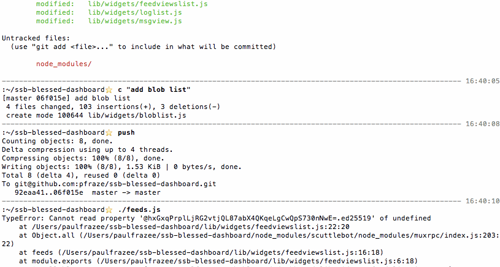

# SSB Blessed Dashboard

```
git clone https://github.com/pfraze/ssb-blessed-dashboard.git
cd ssb-blessed-dashboard
npm install
```

Then:

```
./feeds.js    # feed explorer
./gossip.js   # gossip status
```

**Feeds.js**

